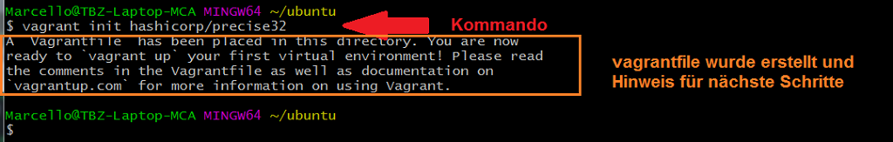

[10]: https://github.com
[20]: https://www.vagrantup.com/docs

# M300 Webserver mit Vagrant aufsetzen und einrichten

Ziel dieses Projektes (Tutorials) ist es, dass die Lernenden in das Thema **GIT** einsteigen können und beim Durcharbeiten gleichzeitig ein Repository mit einer Grundstruktur für das Modul 300 aufsetzen 

## Voraussetzungen:
- [Vagrant](https://www.vagrantup.com/) installiert
- [Virtualbox](https://www.virtualbox.org/wiki/Downloads) und Extension Pack (gleiche Version) installiert  _(Es kann auch ein anderer Provider wie z.B. VMware benutzt werden - Default ist Virtualbox)_
- [Github](https://github.com/) Account
- Windows: [GitBash](https://git-scm.com/downloads) auf dem lokalen Host installiert
- Mac oder Linux: (Bash bereits vorhanden, sonst ebenfalls auf [GitBash](https://git-scm.com/downloads)) verfügbar
- Editor: z.B: [Visual Studio Code](https://code.visualstudio.com/) , [Atom](https://atom.io/) oder [Sublime Text](https://www.sublimetext.com/) etc...

## Vagrant: Sinn und Zweck
Vagrant ist sehr gut geeignet, um schnell und unkompliziert Testumgebungen aufzubauen und, falls der Zweck erfüllt ist, diese auch wieder genau so schnell und unkompliziert zu löschen. In diesem Tutorial wirst Du ein **generelles Verständnis über die Funktionsweise von Vagrant** erhalten und auch schon die ersten "Hands-on"-Übungen durchführen. Falls Du nicht weiter weisst, hilft Dir **[Vagrant-Docs][20]** in allen Belangen weiter. Sämtliche Kommandos sind mit passenden Erklärungen versehen und für Anfänger und auch Fortgeschrittene eine sehr gute Quelle.

## Das folgende Dokument ist wie folgt strukturiert:
1. Im **ersten Abschnitt** **[Vagrant Einsteig](#vagrant-einstieg)** machen wir uns einwenig mit "Vagrant" vertraut. Wir installieren mit einem ersten einfachen deklarativen Script (Vagrantfile) eine Ubuntu-VM und setzen dabei gleich die ersten Vagrant-Kommandos "Hands-on" ein. Nach Abschluss dieses Kapitels sollten Dir die gängigsten Vagrant-Befehle vertraut sein, und Du hast erfolgreich eine erste Vagrantbox aufgesetzt, zum Laufen gebracht und wieder "zerstört" (gelöscht)

2. Im **zweiten Abschnitt** **[NGINX-Webserver deklarativ aufsetzen](#nginx-webserver-deklarativ-aufsetzen)** geht bereits ein erstes Mal zur Sache. Wir setzen Schritt für Schritt einen NGINX-Webserver auf - und zwar so, dass diese Umgebung jederzeit gelöscht und in kürzester Zeit wieder erstellt werden kann. Auch auf einer anderen Umgebung. Der Webseitencontent wird somit persistiert und es kann auch nach einem "Destroy" und einer Neuinstallation wieder auf den früher erstellten Content zugegriffen werden. 

---

## Vagrant Einstieg

### Preflight Checks

Bevor wir loslegen zuerst checken, ob Vagrant, Virtualbox und SSH installiert ist. Wir verwenden hier die "Gitbash" auf Windows. Es spielt in diesem Fall noch keine Rolle, in welchem Verzeichnis wir uns befinden. 

> `$ vagrant -v ` _Checken, welche Vagrant-Version installiert ist_ 
> `$ vboxmanage -v  ` _checken, welche Virtualbox-Version installiert ist_  
> `$ ssh  ` _Checken, ob SSH installiert ist_  
   

### PATH-Variable anpassen / ergänzen (nur bei Bedarf)
Falls das Kommando "vagrant" unter Windows nicht funktioniert, muss allenfalls noch die PATH-Variable angepasst werden (siehe folgendes Bild). Dasselbe gilt auch für "vboxmanage" (Virtualbox)

  

### Setup erstes Projekt (Ubuntu-VM)
Mit folgenden Schritten das Verzeichnis für die erste mit Vagrant erstellte Ubuntu-VM vorbereiten

> `$ cd <Projekt-Mutterverzeichnis> ` _ins Mutterverzeichnis des vorgesehenen Projektes wechseln_ 
> `$ pwd  ` _kontrolle, ob im richtigen Verzeichnis_  
> `$ mkdir ubuntu  ` _Projektverzeichnis "ubuntu" anlegen_   
> `$ cd ubuntu  ` _in's Verzeichnis "ubuntu" wechseln_
  

Mit folgendem Kommando wird im aktuellen Verzeichnis ein Vagrantfile erstellt:
> `$ vagrant init hashicorp/precise32 `  
  

Überprüfen ob das Vagrantfile vorhanden ist:
> `$ ls -ali `
  

Config-file öffnen mit Editor und checken
> `$ vim Vagrantfile ` _Inhalt anschauen_ 
  
 

In VM "hüpfen" und überprüfen
> `$ vagrant ssh ` _in die Ubuntu-VM "hüpfen"_ 
> `$ uname -a  ` _Checken, ob Distro stimmt --> Ubuntu_  
> `$ df -h ` _Diskfree Human-readable_  
  
 

VM zum ersten Mal starten 
> `$ vagrant up ` _Virtualbox-VM mit Vagrant starten_ 
  
 

# Viel Spass und viel Erfolg
- - -
 Dieses Werk ist lizenziert unter einer <a rel="license" href="http://creativecommons.org/licenses/by-nc-sa/3.0/ch/">Creative Commons Namensnennung - Nicht-kommerziell - Weitergabe unter gleichen Bedingungen 3.0 Schweiz Lizenz</a>

- - -

- Autor: Marcello Calisto
- Mail: marcello.calisto@tbz.ch
