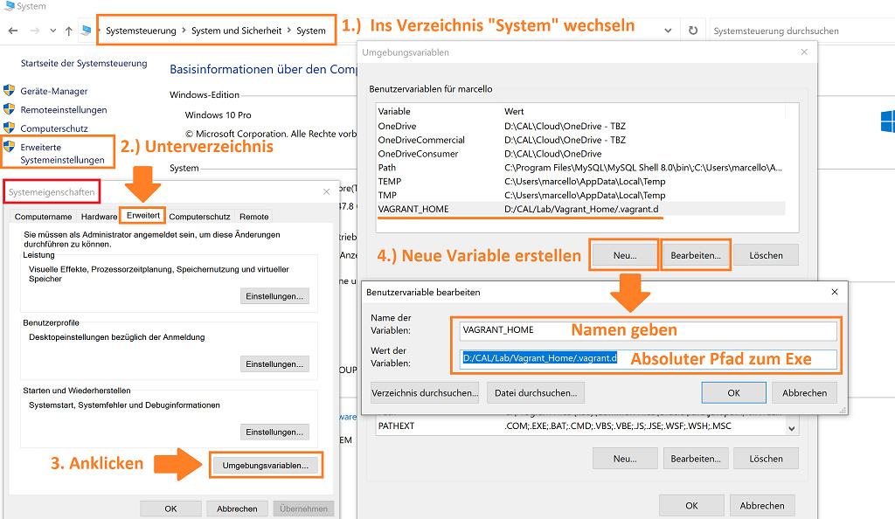
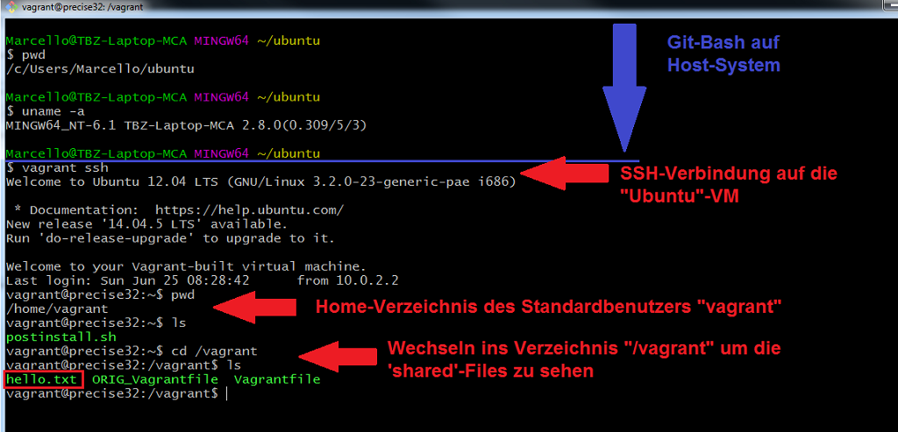
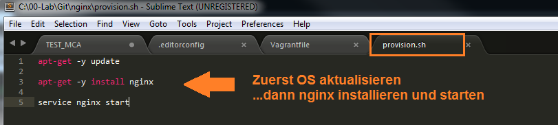
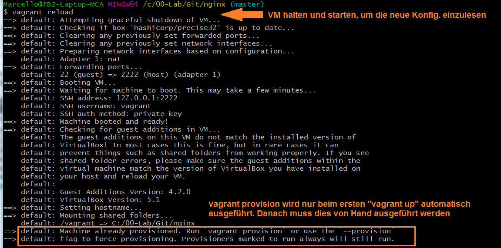
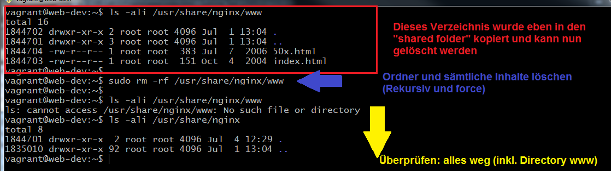

[10]: https://github.com
[20]: https://www.vagrantup.com/docs


# M300 Webserver mit Vagrant aufsetzen und einrichten

Ziel dieses Projektes (Tutorials) ist es, dass die Lernenden in das Thema **GIT** einsteigen können und beim Durcharbeiten gleichzeitig ein Repository mit einer Grundstruktur für das Modul 300 aufsetzen<br>

## Voraussetzungen:
- [Vagrant](https://www.vagrantup.com/) installiert
- [Virtualbox](https://www.virtualbox.org/wiki/Downloads) und Extension Pack (gleiche Version) installiert <br>_(Es kann auch ein anderer Provider wie z.B. VMware benutzt werden - Default ist Virtualbox)_
- [Github](https://github.com/) Account
- Windows: [GitBash](https://git-scm.com/downloads) auf dem lokalen Host installiert
- Mac oder Linux: (Bash bereits vorhanden, sonst ebenfalls auf [GitBash](https://git-scm.com/downloads)) verfügbar
- Editor: z.B: [Visual Studio Code](https://code.visualstudio.com/) , [Atom](https://atom.io/) oder [Sublime Text](https://www.sublimetext.com/) etc...

## Vagrant: Sinn und Zweck
Vagrant ist sehr gut geeignet, um schnell und unkompliziert Testumgebungen aufzubauen und, falls der Zweck erfüllt ist, diese auch wieder genau so schnell und unkompliziert zu löschen. In diesem Tutorial wirst Du ein **generelles Verständnis über die Funktionsweise von Vagrant** erhalten und auch schon die ersten "Hands-on"-Übungen durchführen. Falls Du nicht weiter weisst, hilft Dir **[Vagrant-Docs][20]** in allen Belangen weiter. Sämtliche Kommandos sind mit passenden Erklärungen versehen und für Anfänger und auch Fortgeschrittene eine sehr gute Quelle.


## Das folgende Dokument ist wie folgt strukturiert:
1. Im **ersten Abschnitt** **[Vagrant Einsteig](#vagrant-einstieg)** machen wir uns einwenig mit "Vagrant" vertraut. Wir installieren mit einem ersten einfachen deklarativen Script (Vagrantfile) eine Ubuntu-VM und setzen dabei gleich die ersten Vagrant-Kommandos "Hands-on" ein. Nach Abschluss dieses Kapitels sollten Dir die gängigsten Vagrant-Befehle vertraut sein, und Du hast erfolgreich eine erste Vagrantbox aufgesetzt, zum Laufen gebracht und wieder "zerstört" (gelöscht)

2. Im **zweiten Abschnitt** **[NGINX-Webserver deklarativ aufsetzen](#nginx-webserver-deklarativ-aufsetzen)** geht bereits ein erstes Mal zur Sache. Wir setzen Schritt für Schritt einen NGINX-Webserver auf - und zwar so, dass diese Umgebung jederzeit gelöscht und in kürzester Zeit wieder erstellt werden kann. Auch auf einer anderen Umgebung. Der Webseitencontent wird somit persistiert und es kann auch nach einem "Destroy" und einer Neuinstallation wieder auf den früher erstellten Content zugegriffen werden. 


---

## Vagrant Einstieg

### Preflight Checks

Bevor wir loslegen, zuerst checken, ob Vagrant, Virtualbox und SSH installiert ist. Wir verwenden hier die "Gitbash" auf Windows. Es spielt im Moment noch keine Rolle, in welchem Verzeichnis wir uns befinden. 

> `$ vagrant -v ` _Checken, welche Vagrant-Version installiert ist_<br>
> `$ vboxmanage -v  ` _checken, welche Virtualbox-Version installiert ist_ <br>
> `$ ssh  ` _Checken, ob SSH installiert ist_<br>
   


### PATH-Variable auf Host (Windows) anpassen + ergänzen (nur bei Bedarf)
Falls das Kommando "vagrant" unter Windows nicht funktioniert, muss allenfalls noch die PATH-Variable angepasst werden (siehe folgendes Bild). Dasselbe gilt auch für "vboxmanage" (Virtualbox)
  

### Setup erstes Projekt (Ubuntu-VM)
Mit folgenden Schritten das Verzeichnis für die erste mit Vagrant erstellte Ubuntu-VM vorbereiten

> `$ cd <Projekt-Mutterverzeichnis> ` _ins Mutterverzeichnis des vorgesehenen Projektes wechseln_<br>
> `$ pwd  ` _kontrolle, ob im richtigen Verzeichnis_ <br>
> `$ mkdir ubuntu  ` _Projektverzeichnis "ubuntu" anlegen_ <br> 
> `$ cd ubuntu  ` _in's Verzeichnis "ubuntu" wechseln_
  


Im aktuellen Verzeichnis ein Vagrantfile (für das OS Ubuntu Precise32) erstellen:
> `$ vagrant init hashicorp/precise32 `
  

Überprüfen ob das Vagrantfile vorhanden ist:
> `$ ls -ali `
  

Config-file mit Editor öffnen und ckecken
> `$ vim Vagrantfile ` _Inhalt anschauen_<br>
  
<br>

### VM starten und überprüfen
Wenn soweit alles ok ist, können wir die VM wie folgt zum ersten Mal starten 
> `$ vagrant up ` _Virtualbox-VM mit Vagrant starten_<br>
  
<br>

In VM "hüpfen" und überprüfen
> `$ vagrant ssh ` _in die Ubuntu-VM "hüpfen"_<br>
> `$ uname -a  ` _Checken, ob Distro stimmt --> Ubuntu_ <br>
> `$ df -h ` _Diskfree Human-readable_ <br>
  

VM vom Host aus überprüfen
> `$ exit ` _aus der VM zurück auf den Host_<br>
> `$ vboxmanage list runningvms  ` _checken, welche Virtualbox-VMs am Laufen sind_ <br>
  


### Erste Änderungen im Vagrantfile vornehmen
Standardmässig werden die Virtualbox-VMs „headless“ gestartet. Das heisst „ohne GUI" - nur mit der Kommandozeile. Man kann nun aber das Vagrantfile (Configfile) so anpassen, dass das GUI beim nächsten "` vagrant up `" gestartet
> `$ less Vangrantfile ` _schauen, wo das GUI auskommentiert ist_<br>
  
> `$ vi Vangrantfile ` _entsprechende Zeilen auskommentieren_<br>
  
<br>

Um die getätigten Änderungen im Vagrantfile zu aktivieren, muss dieses neu durchlaufen werden. Das kann mit einem der folgenden zwei Vorgehensweisen erfolgen 
> 1. `$ vagrant halt ` danach `$ vagrant up ` _Virtualbox-VM mit Vagrant stoppen und danach starten_<br>
> 2. `$ vagrant reload ` _Virtualbox-VM mit Vagrant quasi "rebooten"_<br>
  
<br>

Wenn das Virtualbox-Fenster erscheint, hier noch ein "Hint", wie man aus dem "Maus und Tastatur gefangen"-Modus (nächstes Bild) kommt ...

```
1. "Pfeil nach unten"-Taste gleichzeitig mit 
2. "Pfeil nach rechts"-Taste drücken
3.  Erst wenn die ersten beiden Tasten gedrückt sind, die
    "Ctrl"-Taste drücken (alle drei Tasten zusammen)
```
  


### Files zwischen Host und VM sharen
„Synced Folders“ Verzeichnisse und Files können zwischen dem Host-System und den VM’s (Guests) ge’shared‘ werden.

Hier ein Beispiel: Einen beliebigen Editor auf dem Host starten, Text eingeben und im Projektverzeichnis speichern (dort wo auch das Vagrantfile abgelegt ist)
  

Um dieses File im Gastsystem zu sehen, muss ich wie folgt vorgehen 
> `$ vagrant ssh ` _auf die Ubuntu-VM "hüpfen"_<br>
> `$ cd /vagrant ` _dieses Verzeichnis ist mit dem Gastsystem ge'sync'ed_<br>
> `$ ls -al ` _hier ist das vorher erstellte **hello.txt** ersichtlich_<br>
  
<br>

### Nützliche Befehle

**VM mit "halt" runterfahren** (abschalten)
```  
$ vagrant halt
```
**VM mit "up" starten**
```  
$ vagrant up
```
...gem. folgendem Screenshot

> `$ cd <Projektverzeichnis> ` _ins richtige Directory wechseln_<br>
> `$ vagrant halt ` _VM runterfahren_<br>
> `$ vagrant up ` _VM starten_<br>
  
<br>


**VM mit "suspend" anhalten/einfrieren.** <br>Free up Memory und CPU. (Z.B. falls ich knapp an Ressourcen bin, weil z.B. noch andere VMs laufen)
```  
$ vagrant suspend
```
**VM mit "resume" wieder reaktivieren.**<br>Geht schneller, als wenn VM frisch gestartet wird
```  
$ vagrant resume
```
...gem. folgendem Screenshot

> `$ cd <Projektverzeichnis> ` _ins richtige Directory wechseln_<br>
> `$ vagrant suspend ` _VM anhalten / einfrieren_<br>
> `$ vagrant resume ` _VM reaktivieren_<br>
  
<br>

**Sämtliche VBox-Eingabemöglichkeiten auflisten** (Virtualbox-Befehl)
```  
$ VBox
```
**Überprüfen, welche VMs gerade laufen** (Virtualbox-Befehl)
```  
$ VBoxManage.exe list vms
```
...gem. folgendem Screenshot
> `$ VBox ` _Zeigt sämtliche VBox-Abfrageoptionen_<br>
> `$ VBoxManage.exe list vms ` _Zeigt, welche VMs aktuell gestartet sind_<br>
  
<br>

**VM löschen** (zerstören)<br>Kann beliebig angewendet werden. Einer der grössten Vorteile von Vagrant. Genau diese VM kann später **mit nur einem Kommando** (vagrant up) wieder genau gleich hergestellt werden, wie vor dem Löschen (alle notwendigen Schritte dazu sind im Vagrantfile deklariert)
```  
$ vagrant destroy (-f)
```
**Überprüfen, welche VMs gerade laufen** (Virtualbox-Befehl)
```  
$ VBoxManage.exe list vms
```
...gem. folgendem Screenshot
> `$ vagrant destroy (-f)` _VM komplett löschen (falls nötig mit Parameter **-f** )_<br>
> `$ VBoxManage.exe list vms ` _kontrollieren, ob nicht mehr vorhanden_<br>
  
<br>

**VM wieder neu erstellen**
Probe auf's Exempel. Wir erstellen im Projektordner dieselbe VM neu mit folgendem Befehl.
```  
$ vagrant up
```
Kurze Zeit später... <br>
dieselbe VM, die vorher zerstört wurde, ist innerhalb von wenigen Minuten wieder neu erstellt. Unten ein Screenshot der Windows-Verzeichnisse. Das Ganze kann auch noch wie folgt in der VM überprüft werden:
> `$ vagrant ssh` _in die VM "hüpfen"_<br>
> `$ cd /vagrant ` _das file "hello.txt" sollte wieder ersichtlich sein_<br>
  


**Vagrant Hilfe** (Help)<br>
Hilfe zu sämtlichen Vagrant-Kommandos kann wie folgt bezogen werden

```  
$ vagrant -h
$ vagrant --help
```
...gem. folgendem Screenshot
  
<br>

...oder eine Stufe tiefer zu bestimmten Parametern (z.B. zu "vagrant up")
```  
$ vagrant up -h
```
...gem. folgendem Screenshot
  
<br>

Beim Kommando `$ vagrant status` kann zusätzlich noch der Log-Level definiert werden (untersch. Outputs). Das ist nützlich, wenn Probleme auftreten und diese mit den aktuellen Settings nicht erkennbar sind.<br> Wir unterscheiden zwischen folgenden Status:
 - debug
 - info (normal)
 - warn
 - error

Status wie folgt überprüfen und bei Bedarf anders setzen:
> `$ vagrant status`  _Defaultwert ist "Info"_<br>
> `$ export VAGRANT_LOG=debug ` _ändern, um mehr Infos zu erhalten_<br>
  

Es ist aber auch möglich, den Status der Variable zu ändern, ohne Variable fix zu setzen; und zwar wie folgt:
> `$ vagrant status --debug ` _nur 1x, nicht persistent_

- - - 

# NGINX Webserver deklarativ aufsetzen
In diesem Abschnitt werden wir nun einen NGINX-Webserver mit Vagrant deklarativ aufbauen. Dazu benötigen wir das bereits bekannte Vagrantfile und zusätzlich ein Provision-Shellscript. Dieses Shellscript wird benötigt, um auf der bereitgestellten VM weitere Installationen und Konfigurationen durchzuführen. Damit diese Umgebung jederzeit und ortsunabhängig nachgebaut werden kann, nutzen wir Github als "Distributed Version Control System". Wir veröffentlichen den gesamten Code hier in diesem Repository. 

**Vorbereitung**<br>
Zuerst erstellen wir für den NGINX-Webserver ein neues Verzechnis

> `$ cd <Projektverzeichnis> ` _ins richtige Directory wechseln_<br>
> `$ mkdir nginx ` _Verzeichnis erstellen_<br>
> `$ cd nginx ` _Ins Verzeichnis wechseln_<br>
  
<br>

**Projekt initialisieren / OS (Vagrant Box) ergänzen**<br>
In diesem Fall initialisieren wir das Vagrant-Projekt mit dem Minimal-Flag, um die vielen auskommentierten Zeilen im Vagrantfile rauszulöschen und später eigene Inhalte einzufügen. Zusätzlich muss noch ein OS (in Vagrant "Box" genannt) angegeben werden. Wir entscheiden uns für die bereits früher verwendete Ubuntu-Box. Da wir diese bereits früher eingesetzt und ge'downloaded' haben, ist sie bereits lokal vorhanden. Andernfalls muss sie im Vagrant-Repository geholt werden (dauert dann etwas länger)
> `$ vagrant init hashicorp/precise32 --minimal ` _Initialisieren mit der Ubuntu-Box_<br>
  
<br>

**Vagrantfile ergänzen**<br>
Bevor die VM zum erstem Mal gestartet wird, ergänzen wir das Config-File noch mit einem Eintrag. Dazu öffnen wir das Vagrantfile mit einem beliebigen Editor (in diesem Fall Sublime Text) und geben der VM den Namen "web-dev". Dieser VM-Name ist frei wählbar und erscheint später, wenn wir in die VM "hüpfen", auch im Prompt (siehe übernächstes Bild)
  
<br>

**VM zum ersten Mal starten und checken**
> `$ vagrant up ` _VM starten_<br>
  

...anschliessend in die VM "hüpfen" und überprüfen, ob der im Vagrantfile definierte Systemname angezeigt wird
> `$ vagrant ssh ` _in die VM "hüpfen"_<br>
  


**Provision-Script erstellen für weitere SW-Installationen**<br>
Jetzt haben wir zwar ein funktionsfähiges Ubuntu am laufen, aber noch keine zusätzliche Software darin. Damit wir diese deklarativ installieren können, müssen wir ein separates Provision-Skript erstellen. Dieses soll anschliessend automatisch ausgeführt werden und muss deshalb explizit im Vagrantfile definiert werden. In unserem Fall erstellen wir dafür das **`provision.sh`**

**Provision-Script in Vagrantfile einbinden**<br>
Die folgenden Screenshots zeigen, welcher Eintrag dazu im Vagrantfile ergänzt werden muss und wo das **`provision.sh`** abgelegt wird. Damit wird sichergestellt, dass **nach** der OS-Installation weitere SW/Applikationen automatisiert installiert und konfiguriert werden kann. Dieses Script kann auch zu einem späteren Zeitpunkt ergänzt oder angepasst werden. 
  

   

**Provision-Script ergänzen und im Projektverzeichnis ablegen**<br>
Jetzt muss das **`provision.sh`** noch mit Inhalt gefüllt werden. Wir wollen folgende drei Punkte darin festhalten:

```
1. Sämtliche Package-Libraries updaten 
2. NGINX-Packet installieren
3. NGINX starten
```

...die entsprechenden Einträge sehen wie folgt aus:
   


**Provisioning aktivieren**<br>
Wir haben nun das Vagrantfile ergänzt und ein zusätzliches Provisioning-Script erstellt. Um beide Änderungen wirksam zu machen, müssen wir verstehen, wie Vagrant in einem solchen Fall funktioniert.

Versuchen wir mal, die VM zu rebooten:
> `$ vagrant reload ` _VM rebooten_<br>
  


Wir sehen, dass das geänderte Vagrantfile eingelesen wurde. Der Eintrag am Ende zeigt allerdings, dass das **`provision.sh`**-Script nicht ausgeführt werden kann.<br>
**Wichtiger Hinweis:** Vagrant provisioniert standardmässig **nur beim ersten** "`vagrant init`". Das ist in unserem Fall bereits geschehen. Die Meldung ganz am Ende hilft uns dabei und zeigt auch gleich auf, was zu tun ist. Wir müssen das Kommando"`vagrant provision`" nachliefern - als Alternative auch mit dem Flag `--provision` möglich. Erst dann wird das Provision-Script **`provision.sh`** angekickt und somit die Befehle darin ausgeführt.

Hier noch der passende Screenshot dazu. In der letzten Zeile sieht man auch, dass die Installation von NGINX gestartet wurde.
> `$ vagrant provision ` _VM neu provisionieren_<br>
  
  

**Überprüfen, ob NGINX installiert wurde**
Um zu überprüfen, ob die Installation und Provisioning erfolgreich durchgeführt wurden, können wir in die VM wechseln und den Status von NGINX wie folgt abfragen
> `$ vagrant ssh ` _in die VM "hüpfen"_<br>
> `$ service nginx status ` _checken, ob NGINX läuft_
  

In der VM kontrollieren, ob die `index.html`-Seite angezeigt wird:
> `$ wget -q0- localhost ` _HTML-Code im Klartext ausgeben_<br>
  

### Zugriff auf den Webserver via Browser

Damit der Webserver auch von aussen zugänglich gemacht wird, brauchen wir noch ein **"Portforwarding"**. Standardmässig läuft NGINX wie andere Webserver auch, auf **Port 80**. Damit vom Host-Webbrowser auf den Webserver zugegriffen werden kann, muss der Port des Gastsystems an den Host weitergeleitet werden. Wir entscheiden uns in diesem Fall für den **Host-Port 8080**. 

Solche **allgemeine** VM-Konfigurationen werden ebenfalls im **Vagrantfile** eingetragen - in unserem Fall gleich unterhalb des Pfades zum Provision-Script
   

Bei der anschliessenden Überprüfung auf dem Host-Browser erkennen wir nun aber, dass der Zugriff auf die index.html des Gastsystems (noch) nicht funktioniert

`localhost:8080` _Localhost oder Hosts-IP plus definierten Host-Port in beliebigen Browser eingeben_
  
  ...es erscheit die Fehlermeldung, dass **keine** Verbindung zum Webserver aufgebaut werden kann
 

Der Grund, weshalb unsere Verbindung noch nicht funkioniert, ist einmal mehr im Config-file zu suchen. Wir haben zwar den Portforwarding-Eintrag im Vagrantfile gespeichert, aber dieses wurde seither noch nicht aktiviert.
**Wichtig:** Um das abgeänderte Vagrantfile zu aktivieren, reicht ein **Reboot** (oder hier "Reload" genannt). Der Parameter **`--provision`** muss in diesem Fall **NICHT** ausgeführt werden. Das wäre nur nötig, wenn das verlinkte Shellscript (**provision.sh**) abgeändert worden wäre. Das ist hier allerdings **NICHT** der Fall.<br>

Hier der Beweis:
> `$ vagrant reload ` _VM rebooten - Portforwarding **80** auf **8080** wird gesetzt_<br>
  

_...erneut_ `localhost:8080` _in beliebigen Browser eingeben... und - **es funktioniert**_
 


### NGINX Configuration-File anpassen, um persistente Nutzung zu ermöglichen

**Das funktioniert bis jetzt**<br>
Jetzt ist soweit alles so vorbereitet, dass der NGINX Web-Dienst jederzeit und ortsunabhängig aufgesetzt werden kann. Der aktuelle Stand ermöglicht es uns, die Umgebung sehr schnell hochzufahren und danach mit einem Webbrowser über `localhost:8080` auf den Webserver zuzugreifen. Mehr allerdings (noch) nicht. <br>
**Das funktioniert bis jetzt NOCH NICHT**<br>
Falls wir z.B. Änderungen innerhalb der VM (z.B. im Web-content) durchführen, wären diese **nach** einem `$ vagrant destroy` / `$ vagrant up` für immer und ewig **gelöscht**. Wir müssen in einem nächsten Schritt also sicherstellen, dass unsere Testumgebung Änderungen festhalten (persistieren) kann - sonst ist das Setup einer solchen Entwicklungsumgebung eigentlich zwecklos.  

 Folgende Schritte sind notwendig, um dieses Problem zu lösen:

**1. Configuration-File für den NGINX-Webdienst analysieren**<br>
Wenn in einer Linux-Umgebung ein Dienst startet, wird als erstes das zugehörige Config-file durchgearbeitet. Dieses befindet sich standardmässig im Verzeichnis **/etc**.
 Das Config-file des NGINX-Webdienstes befindet sich auf Ubuntu im Verzeichnis **/etc/nginx/sites-enabled** und lautet **default**. In der folgenden Sequenz "hüpfen" wir in die VM und schauen uns die Standard-Configuration dieses Files mal an. Dieses File müssen wir später in einem lokalen Verzeichnis ablegen und so abändern, dass der Pfad zum Web-Content nicht mehr auf ein Unterverzeichnis der VM "pointet", sondern auf ein "shared" Verzeichnis, welches lokal abgelegt ist und bei einem `$ vagrant destroy` nicht gelöscht wird.

Umsetzung:
> `$ vagrant ssh ` _in die VM "hüpfen"_<br>
> `$ ls /etc/nginx/sites-enabled/default ` _Config-file von NGINX_<br>
> `$ head -30 /etc/nginx/sites-enabled/default ` _die ersten 30 Zeilen ausgeben_<br>
  

...im orangen Rahmen sehen wir, dass sämtlicher Web-Content des NGINX-Webservers in folgendem Verzeichnis abgelegt wird:

```
/usr/share/nginx/www
```
Mit folgenden Kommandos können wir kurz überprüfen, ob das index.html auch wirklich in diesem Verzeichnis liegt
> `$ ls /usr/share/nginx/www ` _Files im Verzeichnis abrufen_<br>
> `$ cat /usr/share/nginx/www/index.html ` _html-Code des index.html-Files ausgeben_<br>
  


**2. Configuration-File "persistent" machen und darin Pfad für den NGINX-Webdienst anpassen**<br>
Damit unser Web-Content persistent und unabhängig von der VM entwickelt werden kann, müssen wir das NGINX-Configfile `/etc/nginx/sites-enabled/default` in ein Unterverzeichnis des **Shared-Folders** kopieren. Dieses Unterverzeichnis nennen wir zwecks Nachvollziehbarkeit genau wie das Original `sites-enabled`. <br> 
**Zur Erinnerung:** Der **Shared-Folder** (dort wo auch das Vagrantfile liegt), ist auf der VM unter `/vagrant` eingehängt. Der absolute Pfad des neuen, persistenten Files, muss also neu `/vagrant/sites-enabled/default` lauten. Anschliessend müssen wir den Inhalt dieses Files ebenfalls noch anpassen. Und zwar so, dass danach der Link zum NGINX-Content ebenfalls nicht mehr in die VM verweist, sondern auf ein weiteres, neu zu erstellendes, Web-Content-Unterverzeichnis `www` im **Shared-Folder** verweist. 

Mit folgenden Kommandos können wir kurz überprüfen, ob das index.html auch wirklich in diesem Verzeichnis liegt
> `$ vagrant ssh ` _in die VM hüpfen_<br>
> `$ cd /etc/nginx/sites-enabled ` _ins Verzeichnis des NGINX-Config-files hüpfen_<br>
> `$ ls -al ` _das Config-file heisst **default**_<br>
> `$ mkdir /vagrant/sites-enabled ` _Dasselbe Verzeichnis im **Shared-Folder** erstellen_<br>
> `$ cp default /vagrant/sites-enabled ` _**default** in den **Shared-Folder** kopieren_<br>
  


**3. NGINX Web-Content "persistent" machen**<br>
Wie bereits unter Punkt 2. kurz angesprochen, muss der gesamte Web-Content ebenfalls auf dem **Shared-Folder** abgelegt werden, damit er persistent bleibt. Damit das funktioniert, muss das Verzeichnis `/usr/share/nginx/www` plus alle darin abgelegten Files auf den **Shared-Folder** kopiert werden. Anschliessend muss im Config-File **default** noch der absolute Pfad entsprechend auf dieses Verzeichnis angepasst werden.

Mit folgenden Kommandos können wir den **www**-Ordner und seinen Content auf den **Shared-Folder** kopieren
> `$ ls -ali /vagrant ` _Aktueller Inhalt des Shared-Folders_<br>
> `$ cp -r /usr/share/nginx/www /vagrant/www ` _Verzeichnis inkl. Content kopieren_<br>
> `$ ls -ali /vagrant/www ` _kontrollieren, ob's geklappt hat_<br>
  
  ...Kontrolle im Browser
  


Nachdem das gesamte Webserver-Verzeichnis auf den **Shared-Folder** (/vagrant) kopiert worden ist, kann das alte Quellverzeichnis inkl. Inhalt gelöscht werden. Dasselbe gilt auch für das Config-File im /etc/nginx/sites-enabled Verzeichnis.<br>
**Achtung:** Da diese Files bei einer Neuinstallation (vagrant destroy / vagrant up) wieder installiert werden würden, müssen wir diese **rm**-Befehle auch noch in das **Provision.sh**-Script eintragen (siehe weiter unten). So stellen wir sicher, dass sie auch gleich wieder gelöscht werden und wir stattdessen auf die aktuellen **Shared-Folder**-Files zugreifen.
> `$ ls -ali /usr/share/nginx/www ` _"altes" Verzeichnis_<br>
> `$ sudo rm -rf /usr/share/nginx/www ` _Verzeichnis inkl. Content löschen_<br>
> `$ ls -ali /usr/share/nginx ` _kontrollieren, ob's geklappt hat_<br>
  
  ...Kontrolle im Browser
  

Es folgen nun noch die Anpassung des files **provision.sh**, um diese Änderungen persistent zu machen. Jedes Mal wenn die VM neu erstellt wird (`vagrant distroy` / `vagrant up`) soll sichergestellt sein, dass das neue Standard-Config-File gleich wieder gelöscht - und mit dem überarbeiteten Config-File ersetzt wird
> `$ rm -rf /etc/nginx/sites-enabled ` _Verzeichnis inkl. Content löschen_<br>
> `$ cp -r /vagrant/sites-enabled /etc/nginx ` _Aktuelles Config-file ins VM-Verzeichnis kopieren_<br>
  


- - -


# Viel Spass und viel Erfolg
- - -
<a rel="license" href="http://creativecommons.org/licenses/by-nc-sa/3.0/ch/"></a><br />Dieses Werk ist lizenziert unter einer <a rel="license" href="http://creativecommons.org/licenses/by-nc-sa/3.0/ch/">Creative Commons Namensnennung - Nicht-kommerziell - Weitergabe unter gleichen Bedingungen 3.0 Schweiz Lizenz</a>

- - -

- Autor: Marcello Calisto
- Mail: marcello.calisto@tbz.ch
