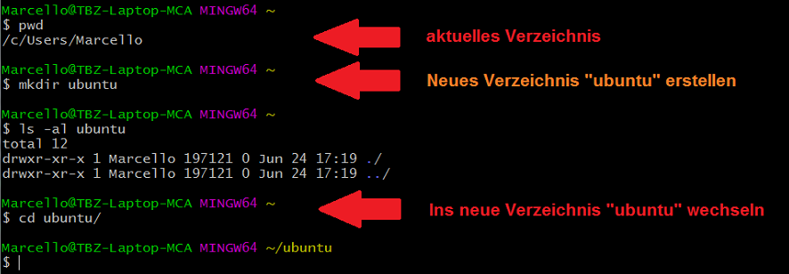
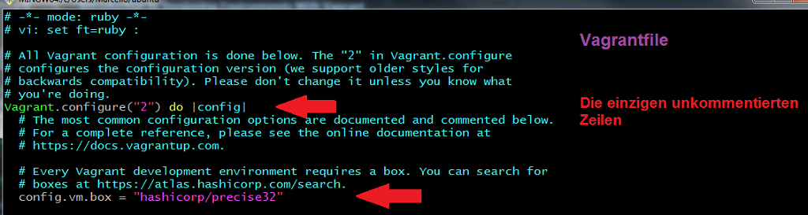

[10]: https://github.com
[20]: https://www.vagrantup.com/docs


# M300 Webserver mit Vagrant aufsetzen und einrichten

Ziel dieses Projektes (Tutorials) ist es, dass die Lernenden in das Thema **GIT** einsteigen können und beim Durcharbeiten gleichzeitig ein Repository mit einer Grundstruktur für das Modul 300 aufsetzen<br>

## Voraussetzungen:
- [Vagrant](https://www.vagrantup.com/) installiert
- [Virtualbox](https://www.virtualbox.org/wiki/Downloads) und Extension Pack (gleiche Version) installiert <br>_(Es kann auch ein anderer Provider wie z.B. VMware benutzt werden - Default ist Virtualbox)_
- [Github](https://github.com/) Account
- Windows: [GitBash](https://git-scm.com/downloads) auf dem lokalen Host installiert
- Mac oder Linux: (Bash bereits vorhanden, sonst ebenfalls auf [GitBash](https://git-scm.com/downloads)) verfügbar
- Editor: z.B: [Visual Studio Code](https://code.visualstudio.com/) , [Atom](https://atom.io/) oder [Sublime Text](https://www.sublimetext.com/) etc...

## Vagrant: Sinn und Zweck
Vagrant ist sehr gut geeignet, um schnell und unkompliziert Testumgebungen aufzubauen und, falls der Zweck erfüllt ist, diese auch wieder genau so schnell und unkompliziert zu löschen. In diesem Tutorial wirst Du ein **generelles Verständnis über die Funktionsweise von Vagrant** erhalten und auch schon die ersten "Hands-on"-Übungen durchführen. Falls Du nicht weiter weisst, hilft Dir **[Vagrant-Docs][20]** in allen Belangen weiter. Sämtliche Kommandos sind mit passenden Erklärungen versehen und für Anfänger und auch Fortgeschrittene eine sehr gute Quelle.


## Das folgende Dokument ist wie folgt strukturiert:
1. Im **ersten Abschnitt** **[Vagrant Einsteig](#vagrant-einstieg)** machen wir uns einwenig mit "Vagrant" vertraut. Wir installieren mit einem ersten einfachen deklarativen Script (Vagrantfile) eine Ubuntu-VM und setzen dabei gleich die ersten Vagrant-Kommandos "Hands-on" ein. Nach Abschluss dieses Kapitels sollten Dir die gängigsten Vagrant-Befehle vertraut sein, und Du hast erfolgreich eine erste Vagrantbox aufgesetzt, zum Laufen gebracht und wieder "zerstört" (gelöscht)

2. Im **zweiten Abschnitt** **[NGINX-Webserver deklarativ aufsetzen](#nginx-webserver-deklarativ-aufsetzen)** geht bereits ein erstes Mal zur Sache. Wir setzen Schritt für Schritt einen NGINX-Webserver auf - und zwar so, dass diese Umgebung jederzeit gelöscht und in kürzester Zeit wieder erstellt werden kann. Auch auf einer anderen Umgebung. Der Webseitencontent wird somit persistiert und es kann auch nach einem "Destroy" und einer Neuinstallation wieder auf den früher erstellten Content zugegriffen werden. 


---

## Vagrant Einstieg

### Preflight Checks

Bevor wir loslegen zuerst checken, ob Vagrant, Virtualbox und SSH installiert ist. Wir verwenden hier die "Gitbash" auf Windows. Es spielt im Moment noch keine Rolle, in welchem Verzeichnis wir uns befinden. 

> `$ vagrant -v ` _Checken, welche Vagrant-Version installiert ist_<br>
> `$ vboxmanage -v  ` _checken, welche Virtualbox-Version installiert ist_ <br>
> `$ ssh  ` _Checken, ob SSH installiert ist_<br>
   


### PATH-Variable auf Host (Windows) anpassen + ergänzen (nur bei Bedarf)
Falls das Kommando "vagrant" unter Windows nicht funktioniert, muss allenfalls noch die PATH-Variable angepasst werden (siehe folgendes Bild). Dasselbe gilt auch für "vboxmanage" (Virtualbox)
  

### Setup erstes Projekt (Ubuntu-VM)
Mit folgenden Schritten das Verzeichnis für die erste mit Vagrant erstellte Ubuntu-VM vorbereiten

> `$ cd <Projekt-Mutterverzeichnis> ` _ins Mutterverzeichnis des vorgesehenen Projektes wechseln_<br>
> `$ pwd  ` _kontrolle, ob im richtigen Verzeichnis_ <br>
> `$ mkdir ubuntu  ` _Projektverzeichnis "ubuntu" anlegen_ <br> 
> `$ cd ubuntu  ` _in's Verzeichnis "ubuntu" wechseln_
  


Im aktuellen Verzeichnis ein Vagrantfile (für das OS Ubuntu Precise32) erstellen:
> `$ vagrant init hashicorp/precise32 `
  

Überprüfen ob das Vagrantfile vorhanden ist:
> `$ ls -ali `
  

Config-file mit Editor öffnen und ckecken
> `$ vim Vagrantfile ` _Inhalt anschauen_<br>
  
<br>

### VM starten und überprüfen
Wenn soweit alles ok ist, können wir die VM wie folgt zum ersten Mal starten 
> `$ vagrant up ` _Virtualbox-VM mit Vagrant starten_<br>
  
<br>

In VM "hüpfen" und überprüfen
> `$ vagrant ssh ` _in die Ubuntu-VM "hüpfen"_<br>
> `$ uname -a  ` _Checken, ob Distro stimmt --> Ubuntu_ <br>
> `$ df -h ` _Diskfree Human-readable_ <br>
  

VM vom Host aus überprüfen
> `$ exit ` _aus der VM zurück auf den Host_<br>
> `$ vboxmanage list runningvms  ` _checken, welche Virtualbox-VMs am Laufen sind_ <br>
  


### Erste Änderungen im Vagrantfile vornehmen
Standardmässig werden die Virtualbox-VMs „headless“ gestartet. Das heisst „ohne GUI" - nur mit der Kommandozeile. Man kann nun aber das Vagrantfile (Configfile) so anpassen, dass das GUI beim nächsten "` vagrant up `" gestartet
> `$ less Vangrantfile ` _schauen, wo das GUI auskommentiert ist_<br>
  
> `$ vi Vangrantfile ` _entsprechende Zeilen auskommentieren_<br>
  
<br>

Um die getätigten Änderungen im Vagrantfile zu aktivieren, muss dieses neu durchlaufen werden. Das kann mit einem der folgenden zwei Vorgehensweisen erfolgen 
> 1. `$ vagrant halt ` danach `$ vagrant up ` _Virtualbox-VM mit Vagrant stoppen und danach starten_<br>
> 2. `$ vagrant reload ` _Virtualbox-VM mit Vagrant quasi "rebooten"_<br>
  
<br>

Wenn das Virtualbox-Fenster erscheint, hier noch ein "Hint", wie man aus dem "Maus und Tastatur gefangen"-Modus (nächstes Bild) kommt ...

```
1. "Pfeil nach unten"-Taste gleichzeitig mit 
2. "Pfeil nach rechts"-Taste drücken
3.  Erst wenn die ersten beiden Tasten gedrückt sind, die
    "Ctrl"-Taste drücken (alle drei Tasten zusammen)
```
  


### Files zwischen Host und VM sharen
„Synced Folders“ Verzeichnisse und Files können zwischen dem Host-System und den VM’s (Guests) ge’shared‘ werden.

Hier ein Beispiel: Einen beliebigen Editor auf dem Host starten, Text eingeben und im Projektverzeichnis speichern (dort wo auch das Vagrantfile abgelegt ist)
  

Um dieses File im Gastsystem zu sehen, muss ich wie folgt vorgehen 
> `$ vagrant ssh ` _auf die Ubuntu-VM "hüpfen"_<br>
> `$ cd /vagrant ` _dieses Verzeichnis ist mit dem Gastsystem ge'sync'ed_<br>
> `$ ls -al ` _hier ist das vorher erstellte **hello.txt** ersichtlich_<br>
  
<br>

### Nützliche Befehle

**VM mit "halt" runterfahren** (abschalten)
```  
$ vagrant halt
```
**VM mit "up" starten**
```  
$ vagrant up
```
...gem. folgendem Screenshot

> `$ cd <Projektverzeichnis> ` _ins richtige Directory wechseln_<br>
> `$ vagrant halt ` _VM runterfahren_<br>
> `$ vagrant up ` _VM starten_<br>
  
<br>


**VM mit "suspend" anhalten/einfrieren.** <br>Free up Memory und CPU. (Z.B. falls ich knapp an Ressourcen bin, weil z.B. noch andere VMs laufen)
```  
$ vagrant suspend
```
**VM mit "resume" wieder reaktivieren.**<br>Geht schneller, als wenn VM frisch gestartet wird
```  
$ vagrant resume
```
...gem. folgendem Screenshot

> `$ cd <Projektverzeichnis> ` _ins richtige Directory wechseln_<br>
> `$ vagrant suspend ` _VM anhalten / einfrieren_<br>
> `$ vagrant resume ` _VM reaktivieren_<br>
  
<br>

**Sämtliche VBox-Eingabemöglichkeiten auflisten** (Virtualbox-Befehl)
```  
$ VBox
```
**Überprüfen, welche VMs gerade laufen** (Virtualbox-Befehl)
```  
$ VBoxManage.exe list vms
```
...gem. folgendem Screenshot
> `$ VBox ` _Zeigt sämtliche VBox-Abfrageoptionen_<br>
> `$ VBoxManage.exe list vms ` _Zeigt, welche VMs aktuell gestartet sind_<br>
  
<br>

**VM löschen** (zerstören)<br>Kann beliebig angewendet werden. Einer der grössten Vorteile von Vagrant. Genau diese VM kann später **mit nur einem Kommando** (vagrant up) wieder genau gleich hergestellt werden, wie vor dem Löschen (alle notwendigen Schritte dazu sind im Vagrantfile deklariert)
```  
$ vagrant destroy
```
**Überprüfen, welche VMs gerade laufen** (Virtualbox-Befehl)
```  
$ VBoxManage.exe list vms
```
...gem. folgendem Screenshot
> `$ vagrant destroy` _VM komplett löschen_<br>
> `$ VBoxManage.exe list vms ` _kontrollieren, ob nicht mehr vorhanden_<br>
  
<br>

**VM wieder neu erstellen**
Probe auf's Exempel. Wir erstellen im Projektordner dieselbe VM neu mit folgendem Befehl.
```  
$ vagrant up
```
Kurze Zeit später... <br>
dieselbe VM, die vorher zerstört wurde, ist innerhalb von wenigen Minuten wieder neu erstellt. Unten ein Screenshot der Windows-Verzeichnisse. Das Ganze kann auch noch wie folgt in der VM überprüft werden:
> `$ vagrant ssh` _in die VM "hüpfen"_<br>
> `$ cd /vagrant ` _das file "hello.txt" sollte wieder ersichtlich sein_<br>
  


**Vagrant Hilfe** (Help)<br>
Hilfe zu sämtlichen Vagrant-Kommandos kann wie folgt bezogen werden

```  
$ vagrant -h
$ vagrant --help
```
...gem. folgendem Screenshot
  
<br>

...oder eine Stufe tiefer zu bestimmten Parametern (z.B. zu "vagrant up")
```  
$ vagrant up -h
```
...gem. folgendem Screenshot
  
<br>

Beim Kommando `$ vagrant status` kann zusätzlich noch der Log-Level definiert werden (untersch. Outputs). Das ist nützlich, wenn Probleme auftreten und diese mit den aktuellen Settings nicht erkennbar sind.<br> Wir unterscheiden zwischen folgenden Status:
 - debug
 - info (normal)
 - warn
 - error

Status wie folgt überprüfen und bei Bedarf anders setzen:
> `$ vagrant status`  _Defaultwert ist "Info"_<br>
> `$ export VAGRANT_LOG=debug ` _ändern, um mehr Infos zu erhalten_<br>
  

Es ist aber auch möglich, den Status der Variable zu ändern, ohne Variable fix zu setzen; und zwar wie folgt:
> `$ vagrant status --debug ` _nur 1x, nicht persistent_

- - - 

# NGINX Webserver deklarativ aufsetzen
In diesem Abschnitt werden wir nun einen NGINX-Webserver mit Vagrant deklarativ aufbauen. Dazu benötigen wir das bereits bekannte Vagrantfile und zusätzlich ein Provision-Shellscript. Dieses Shellscript wird benötigt, um auf der bereitgestellten VM weitere Installationen und Konfigurationen durchzuführen. Damit diese Umgebung jederzeit und ortsunabhängig nachgebaut werden kann, nutzen wir Github als "Distributed Version Control System". Wir veröffentlichen den gesamten Code hier in diesem Repository. 

Zuerst erstellen wir für den NGINX-Webserver ein neues Verzechnis

> `$ cd <Projektverzeichnis> ` _ins richtige Directory wechseln_<br>
> `$ mkdir nginx ` _Verzeichnis erstellen_<br>
> `$ cd nginx ` _Ins Verzeichnis wechseln_<br>
  
<br>

Danach initialisieren wir das Vagrant-Projekt mit dem Minimal-Flag, um die vielen auskommentierten Zeilen im Vagrantfile rauszulöschen und eigene Inhalte zu kreieren. Wir entscheiden uns für die bereits früher verwendete Ubuntu-Box.
> `$ vagrant init hashicorp/precise32 --minimal ` _Initialisieren mit der Ubuntu-Box_<br>
  
<br>

Danach öffnen wir das Vagrantfile mit einem beliebigen Editor (in diesem Fall Sublime Text) und nennen die VM "web-dev". Dieser Name erscheint später als Prompt, wenn wir in die VM "hüpfen" (siehe übernächstes Bild)
  
<br>

VM zum ersten Mal starten
> `$ vagrant up ` _VM starten_<br>
  
<br>

In die VM "hüpfen" und überprüfen, ob der im Vagrantfile definierte Systemname angezeigt wird
> `$ vagrant ssh ` _in die VM "hüpfen"_<br>
  
<br>

Jetzt haben wir zwar ein funktionsfähiges Ubuntu am laufen, aber noch keine zusätzliche Software darin. Damit wir diese anschliessend deklarativ installieren können, müssen wir ein separates Provision-Skript erstellen. Damit dieses anschliessend ausgeführt wird, muss dies explizit im Vagrantfile definiert werden. In unserem Fall erstellen wir dafür das **`provision.sh`**

Die folgenden Screenshots zeigen, wie dies im Vagrantfile ergänzt werden soll und wo das **`provision.sh`** abgelegt werden soll
  

   

Jetzt muss das **`provision.sh`** noch mit Inhalt gefüllt werden. Wir wollen folgende drei Punkte darin festhalten:

```
1. Sämtliche Package-Libraries updaten 
2. NGINX-Packet installieren
3. NGINX starten
```

...die entsprechenden Einträge sehen wie folgt aus:
   

Wir haben nun das Vagrantfile ergänzt und ein zusätzliches Provisioning-Script erstellt. Um beide Änderungen wirksam zu machen, müssen wir verstehen, wie Vagrant in einem solchen Fall funktioniert.

Versuchen wir mal, die VM zu rebooten:
> `$ vagrant reload ` _VM rebooten_<br>
  


Wir sehen, dass das geänderte Vagrantfile eingelesen wurde. Der Eintrag am Ende zeigt allerdings, dass das **`provision.sh`**-Script nicht ausgeführt werden kann.<br>
**Wichtiger Hinweis:** Vagrant provisioniert standardmässig nur beim ersten "`vagrant init`". Das ist in unserem Fall bereits geschehen. Die Meldung ganz am Ende hilft uns dabei und zeigt auch gleich auf, was zu tun ist. Wir müssen noch das Flag `--provision` setzen, damit auch das Provision-Script angekickt wird. 

Mit folgendem Kommando wird das Povision-Script nach dem Booten der VM angekickt. Unten sieht man auch, dass die Installation von NGINX gestartet wurde.
> `$ vagrant provision ` _VM neu provisionieren_<br>
  
  

Überprüfen, ob NGINX installiert wurde.
> `$ vagrant ssh ` _in die VM "hüpfen"_<br>
> `$ service nginx status ` _checken, ob NGINX läuft_
  

Kontrollieren, ob die `index.html`-Seite angezeigt wird:
> `$ wget -q0- localhost ` _HTML-Code im Klartext ausgeben_<br>
  


- - -

# Viel Spass und viel Erfolg
- - -
<a rel="license" href="http://creativecommons.org/licenses/by-nc-sa/3.0/ch/"></a><br />Dieses Werk ist lizenziert unter einer <a rel="license" href="http://creativecommons.org/licenses/by-nc-sa/3.0/ch/">Creative Commons Namensnennung - Nicht-kommerziell - Weitergabe unter gleichen Bedingungen 3.0 Schweiz Lizenz</a>

- - -

- Autor: Marcello Calisto
- Mail: marcello.calisto@tbz.ch
